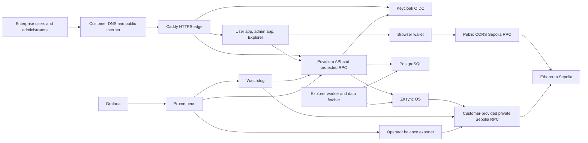

# System and value overview

| Document metadata | Value |
| --- | --- |
| Status | Draft — blocked for customer release pending the release funding benchmark |
| Purpose | Explain what the customer-hosted evaluation is, how it works, and what it demonstrates |
| Audience | Enterprise architects, platform engineers, security engineers, identity engineers, blockchain engineers, and technical evaluators |
| Deployment model | Persistent, single-VPS Prividium evaluation settled on Ethereum Sepolia |
| Applicable release | [versions.lock.yaml](../../deployment/versions.lock.yaml) |
| Document version | 0.1-draft |
| Repository commit | Recorded per customer in the adoption record; must match the approved handoff |
| Maintainer | Matter Labs Prividium Engineering |
| Last successful customer-release rehearsal | Not yet recorded |
| Required approvers | Technical and security approvers: TBD before customer release |
| Next review | After the release rehearsal or any locked-release change |
| Last revised | 2026-07-23 |

## What Prividium is in this evaluation

Prividium provides an identity- and permission-aware access layer around a
dedicated ZKsync environment. In this deployment, an enterprise can evaluate a
blockchain application environment that it hosts and administers while still
settling chain activity to Ethereum Sepolia.

The evaluation combines:

- a dedicated ZKsync OS chain;
- Prividium authentication, authorization, administration, and protected
  API/RPC access;
- a reference OIDC identity provider;
- an authenticated Block Explorer;
- browser-facing applications behind automatic HTTPS;
- active transaction and settlement checks;
- customer-controlled infrastructure, DNS, secrets, and operational access.

This is a permissioned evaluation, but permissioning must not be interpreted as
a guarantee that transaction content or Sepolia data is confidential. Use
synthetic users, transactions, and business data.

## Value demonstrated

| Customer question | What the core environment demonstrates |
| --- | --- |
| Can access use an OIDC identity boundary? | The bundled Keycloak demonstrates OIDC-based identity and Prividium permissions; federation with the customer's enterprise IdP is not evaluated |
| Can unauthenticated chain access be rejected? | The public RPC path is protected and unauthenticated requests are denied |
| Can authorized users transact? | An authenticated user can fund an account and submit L2 transactions |
| Can administrators control the environment? | A dedicated administration application exposes the permitted management journey |
| Can users and operators inspect activity? | An authenticated Explorer indexes chain activity and transaction status |
| Can the platform team observe basic health? | Watchdog, Prometheus, Grafana, and an operator-balance exporter provide evaluation telemetry |
| Can the customer operate the environment? | The VPS, DNS, runtime secrets, identity data, databases, and deployment records remain under customer control |
| Can deployed inputs be traced? | Pinned remote images and recorded source commits provide a reviewable release inventory; local builds are not asserted to be byte-for-byte reproducible |

The release lock is a pinned release inventory, not a formal software bill of
materials, vulnerability attestation, or compliance certification.

## Architecture

The browser user application uses a separate customer-provided, public
CORS-enabled Sepolia RPC for wallet and bridging flows. The private RPC is used
only by server-side components and deployment tooling.

## What runs by default

The core stack consists of 18 Compose services.

### Long-running services

| Capability | Services |
| --- | --- |
| Chain and data | `zksyncos`, `postgres` |
| Identity and permissioning | `keycloak`, `prividium-api` |
| Customer applications | `user-panel`, `admin-panel` |
| Edge | `caddy` |
| Explorer | `block-explorer-api`, `block-explorer-app`, `block-explorer-worker`, `block-explorer-data-fetcher` |
| Monitoring | `watchdog`, `prometheus`, `grafana`, `operator-balance-exporter` |

### One-shot prerequisite jobs

| Job | Purpose | State change |
| --- | --- | --- |
| `chain-preflight` | Validates chain artifacts, provider capabilities, roles, and balances before ZKsync OS starts | Read-only validation |
| `bridge-funds` | Moves the Watchdog target balance from Sepolia to L2 | Submits an L1-to-L2 transaction |
| `watchdog-permissions-setup` | Creates or updates the Watchdog database permissions | Changes Prividium database state |

A one-shot job that exits successfully is complete, not unhealthy.

## Core, optional, and deferred capabilities

| Capability | Default state | This guide |
| --- | --- | --- |
| Dedicated ZKsync OS chain | Enabled | Included |
| Prividium API, user app, and admin app | Enabled | Included |
| Keycloak OIDC reference identity | Enabled | Included |
| Block Explorer | Enabled | Included |
| Watchdog, Prometheus, Grafana, and operator balance monitoring | Enabled | Included |
| SSO, EntryPoint contracts, and bundler | Disabled | Scope overview only |
| Webhook service | Disabled | Scope overview only |
| Institutional demo | Disabled and depends on SSO | Scope overview only |
| Airbender prover | Deferred; no prover service starts | Not included |

Optional capabilities add contracts, wallets, DNS, state, and external
dependencies. SSO and demo funding are outside the core funding policy. They
require a separate evaluation decision and are intentionally not enabled as
part of this guide.

## Public interfaces

For `SANDBOX_DOMAIN=sandbox.example.com`, the customer creates six core DNS
records:

| Interface | URL | Intended user |
| --- | --- | --- |
| User application | `https://app.sandbox.example.com` | Evaluators and application users |
| Administration | `https://admin.sandbox.example.com` | Authorized administrators |
| Protected API and RPC | `https://api.sandbox.example.com` | Applications and authenticated clients |
| Block Explorer | `https://explorer.sandbox.example.com` | Authenticated users and operators |
| Explorer API | `https://explorer-api.sandbox.example.com` | Explorer application |
| OIDC issuer | `https://idp.sandbox.example.com/realms/prividium` | Applications and identity clients |

Caddy is the only service that publishes general public application ports:
TCP 80, TCP 443, and UDP 443. Grafana binds to `127.0.0.1:3100` and is accessed
through an SSH tunnel. PostgreSQL, Prometheus, raw ZKsync OS RPC, Keycloak
administration, and internal service ports are not published.

The customer remains responsible for SSH exposure, host hardening, privileged
Docker access, perimeter policy, and any external vulnerability controls.

## Internal trust zones

Compose uses three logical networks:

| Network | Purpose |
| --- | --- |
| `edge` | Connects Caddy to the externally exposed host ports |
| `app` | Carries internal HTTP, RPC, and monitoring traffic |
| `data` | Restricts direct database connectivity to services that need it |

These networks reduce accidental exposure but are not a substitute for host
hardening, workload isolation, or a production network-security design.

## Persistent state

The environment is persistent in the narrow sense that data survives ordinary
container restarts and recreation.

| State | Location |
| --- | --- |
| Chain database | Docker volume `zksyncos_db` |
| Application, Explorer, and identity databases | Docker volume `postgres_data` |
| Keycloak runtime state | Docker volume `keycloak_data` |
| ACME account and certificates | Docker volumes `caddy_data` and `caddy_config` |
| Monitoring history and Grafana state | Docker volumes `prometheus_data` and `grafana_data` |
| Optional SSO shared runtime | Docker volume `sso_runtime`; created by the Compose model and normally unpopulated until SSO is enabled |
| Secret chain intent, wallets, genesis, and server configuration | `/etc/prividium/runtime/chain` |
| Protected funding and readiness reports | `/etc/prividium/runtime/reports` |
| Public role, chain, and deployment records | `deployment/public` |

Persistence does not imply high availability, backup coverage, or disaster
recovery.

## External dependencies

The core deployment depends on:

- one customer-controlled amd64 Linux VPS;
- Docker Engine and Docker Compose v2;
- six DNS `A` records and inbound web access;
- private Prividium image entitlement on Quay;
- public images on other pinned registries;
- outbound access for locked source builds and dependency retrieval;
- a private Sepolia RPC with the required history, log, receipt, and blob
  capabilities;
- a separate browser-safe Sepolia RPC;
- Sepolia ETH;
- Chainlist access for the L2 chain-ID collision check;
- SOPS and an age recipient controlled by the deployment team;
- an initial administrator email.

Because a cold deployment builds some maintained images, registry
authentication alone is not a complete egress test. The chain preparation
phase is the practical cold-build validation.

## Core user and system flow

1. The user opens the customer-hosted application through Caddy.
2. The application redirects the user to the customer-hosted Keycloak realm.
3. Keycloak authenticates the user and issues an OIDC token.
4. Prividium validates identity and permissions before allowing protected API
   or RPC activity.
5. ZKsync OS executes accepted L2 activity.
6. The chain's operators submit the required settlement transactions to
   Ethereum Sepolia through the private RPC.
7. Explorer services index the chain and expose permitted activity.
8. Watchdog continuously exercises core flows and exposes evaluation metrics.

## Scope boundary

This environment is designed to validate integration fit and product value. It
does not demonstrate:

- a production proof system or production verifier;
- multi-host availability or automated failover;
- production capacity, latency, or load characteristics;
- a production enterprise IdP integration;
- confidential handling of regulated or proprietary data;
- production operational support or an alert-response SLA;
- production backup, restoration, or disaster recovery.

Continue to [Deployment readiness and
security](02-deployment-readiness-and-security.md) when the scope matches the
customer's evaluation objective.
